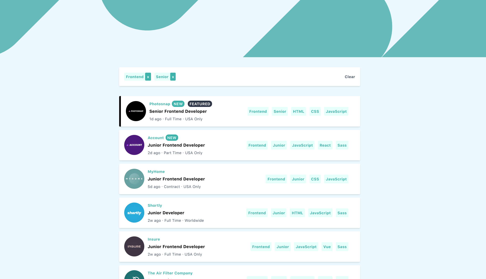
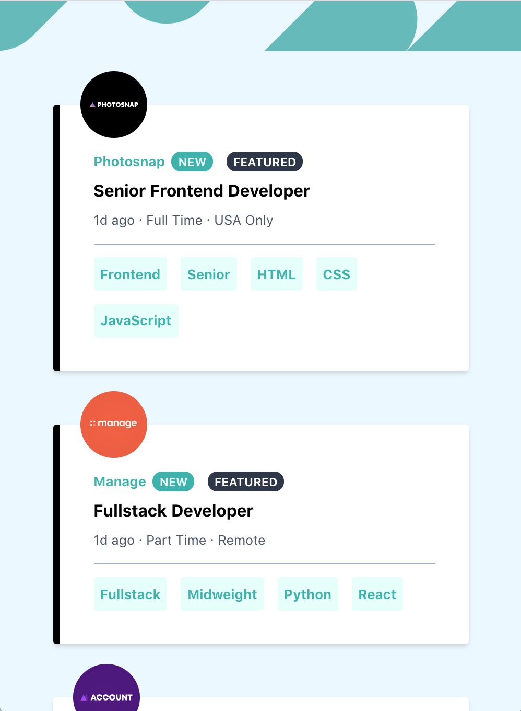
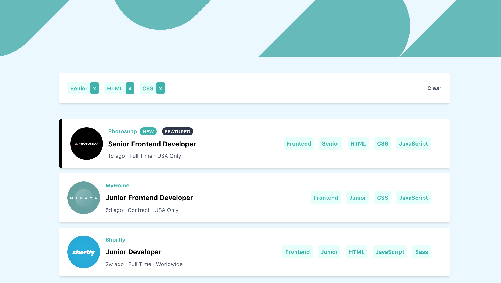

#  Job Listings Challenge

## Welcome! 👋

**This is a job listing react project**

## Project Description

Build out this job listing page, which is a panel of all listed jobs, with roles, dates, company, level, languages and tools info. 

**Languages and tools used for this project**

- Languages:  JavaScript, HTML, CSS
- Tools: React, TailwindCSS

**Some of the functionalities include:**

- Responsive design: View the optimal layout for the site depending on their device's screen size 

  **Image 1: Desktop Viewport**

**Image 2: Mobile Viewport**

- See hover states for all interactive elements on the page

- Filter job listings based on the categories

  **Image 3: Filter by roles, languages, categories**

  

### Filtering

#### Filter by languages

Filter job listings based on the categories using the HTML The categories are:

- Role: Frontend, Backend, Fullstack
- Level: Junior, Midweight, Senior
- Languages:  JavaScript, HTML, CSS
- Tools: React

So, if a job listing is for has the following categories `Frontend, Junior, JavaScript, React`, then the clicked tags will be displayed. 

* User can reset the filter by clicking on "clear" button

The data is included in the src/data.json file. 